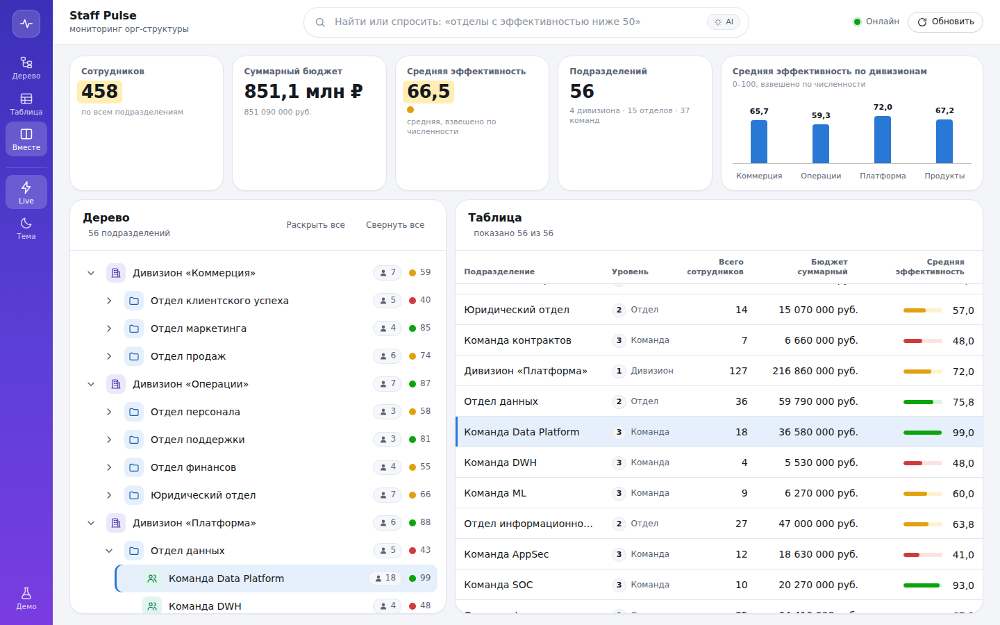
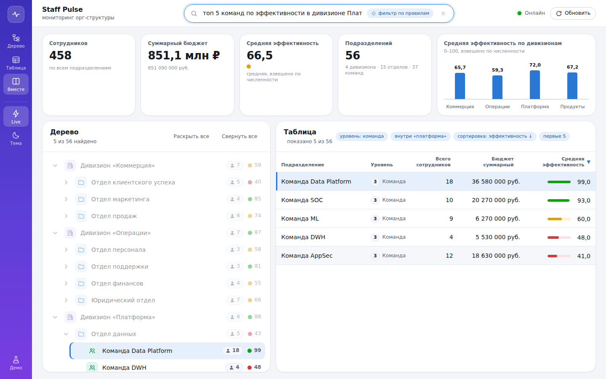
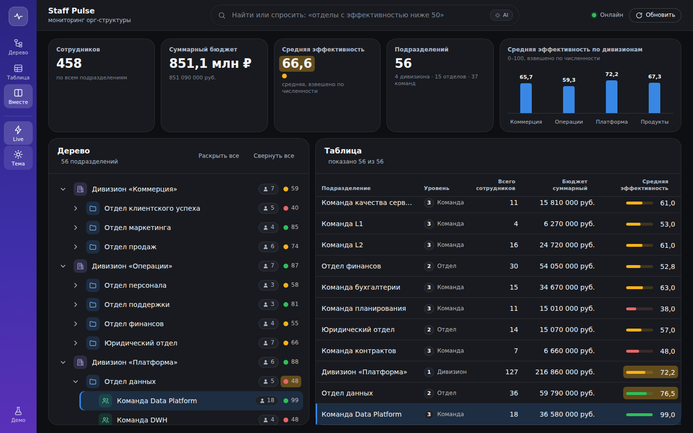
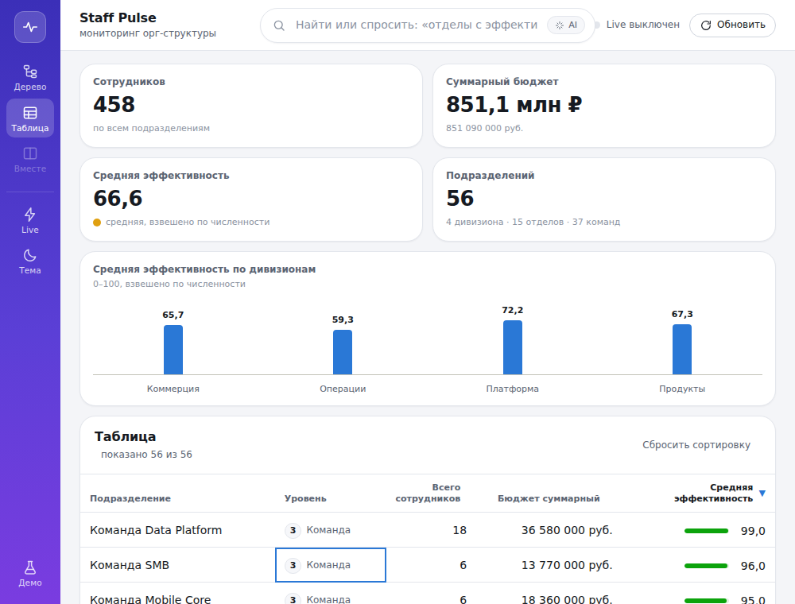
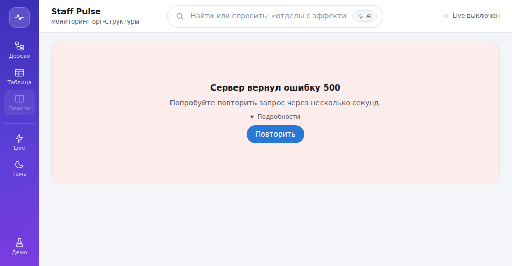

# Staff Pulse — дашборд орг-структуры

Интерактивный мониторинг орг-структуры компании: дерево «дивизионы → отделы → команды»,
аналитическая таблица с агрегированными показателями, live-обновления по WebSocket.

Тестовое задание: React · Vite · TypeScript · styled-components. Каждый этап — тег `step/N`.

Интерфейс: боковая панель с режимами «Дерево / Таблица / Вместе», live и темой; командная строка
поиска с AI в шапке; сводные KPI-плитки и график эффективности по дивизионам; светлая и тёмная
темы.

## Запуск одной командой

```bash
docker compose up --build
```

Клиент — на `http://localhost:8080` (порт задаётся `WEB_PORT` в `.env`): nginx отдаёт статику
со сжатием и проксирует `/api` и `/ws` на сервер. Конфигурация — через `.env` в корне
(скопируйте `.env.example`).

Для разработки без Docker (Node.js ≥ 22.12):

```bash
npm install && npm run dev
```

Поднимаются mock API (`http://localhost:3001`) и клиент (`http://localhost:5173`); Vite проксирует
`/api` и `/ws` на сервер, поэтому CORS не нужен.

Сервер раз в несколько секунд меняет метрики 1–3 подразделений и рассылает патчи по WebSocket:
изменённые ячейки подсвечиваются и гаснут за 1,5 с, индикатор соединения — в шапке.
Настройки — в `.env` (см. `.env.example`): `UPDATE_INTERVAL_MS` (0 — выключить),
`UPDATE_BATCH_MAX`, `HEARTBEAT_MS`, `PATCH_BUFFER_SIZE`. Адрес `/?live=off` отключает канал
на клиенте.

## Скриншоты

| Split-view: KPI, график, дерево и таблица с live-подсветкой | AI-поиск: фраза превращается в фильтр с чипами   |
| ----------------------------------------------------------- | ------------------------------------------------ |
|                |    |
| **Тёмная тема**                                             | **Узкий экран: таблица, клавиатурный фокус**     |
|           |  |
| **Состояние ошибки**                                        |                                                  |
|               |                                                  |

Live-обновления, раскрытие ветки и фильтр в движении: [docs/screenshots/live-updates.gif](docs/screenshots/live-updates.gif).

## Проверка состояний без правки кода

Сервер понимает параметр `scenario`, а клиент прозрачно пробрасывает его из адреса страницы:

| Адрес                                     | Что покажет клиент                              |
| ----------------------------------------- | ----------------------------------------------- |
| `http://localhost:5173/?scenario=slow`    | состояние загрузки (ответ задержан на 2,5 с)    |
| `http://localhost:5173/?scenario=empty`   | пустой ответ                                    |
| `http://localhost:5173/?scenario=error`   | ошибка сервера (HTTP 500) с кнопкой «Повторить» |
| `http://localhost:5173/?scenario=invalid` | ответ не прошёл валидацию схемы                 |
| `http://localhost:5173/?devtools=on`      | панель TanStack Query Devtools (только dev)     |
| `http://localhost:5173/?live=off`         | без live-обновлений                             |

Обрыв соединения проверяется остановкой сервера: индикатор покажет переподключение с обратным
отсчётом (backoff 0,5 с → 1 с → 2 с … до 30 с); после запуска сервера канал восстановится,
пропущенные патчи будут досланы или снимок перезапрошен.

## AI-поиск

Строка поиска над таблицей понимает и подстроку названия, и запрос на естественном языке:

- «отделы с эффективностью ниже 50»
- «команды в дивизионе Платформа с эффективностью выше 70»
- «топ 5 команд по эффективности», «5 худших отделов по эффективности»
- «дивизионы с бюджетом больше 200 млн», «команды от 10 человек»

Запрос уходит на `POST /api/search/parse`, ответ — структурированный фильтр, который клиент
применяет сам и показывает чипами. Если задан `ANTHROPIC_API_KEY`, разбирает языковая модель
(structured output, модель из `ANTHROPIC_MODEL`, по умолчанию `claude-opus-5`); без ключа —
детерминированные правила. Если условия не распознаны, остаётся текстовый поиск. Подробнее —
[ADR-008](docs/adr/008-ai-search-server-side-with-rules-fallback.md).

## Команды

| Команда             | Что делает                                                                  |
| ------------------- | --------------------------------------------------------------------------- |
| `npm run dev`       | сервер + клиент в режиме разработки                                         |
| `npm run build`     | сборка сервера (esbuild) и клиента (Vite) с проверкой бюджета ≤ 200 КБ gzip |
| `npm test`          | все тесты (Vitest projects: contracts, server, web)                         |
| `npm run typecheck` | `tsc` по всем пакетам                                                       |
| `npm run lint`      | ESLint (включая запрет inline-CSS)                                          |
| `npm run format`    | Prettier в режиме проверки                                                  |
| `npm run check`     | typecheck + lint + format + test                                            |

## Структура репозитория

```
apps/web            клиент: React 19 + Vite + styled-components + TanStack Query
apps/server         mock API: node:http, генератор данных с seed, ETag/304, сценарии
packages/contracts  zod/mini-схемы и типы, общие для клиента и сервера
docs/               architecture.md, data-model.md, adr/, ai-log.md
```

Слои клиента и поток данных описаны в [docs/architecture.md](docs/architecture.md), модель данных
и алгоритмы — в [docs/data-model.md](docs/data-model.md), решения — в [docs/adr](docs/adr).

## Этапы

| Тег      | Содержание                                                                              |
| -------- | --------------------------------------------------------------------------------------- |
| `step/1` | монорепозиторий, контракты, mock API, слой кэширования, интерактивное дерево, состояния |
| `step/2` | агрегация, аналитическая таблица, сортировка, фильтр, выделение узла                    |
| `step/3` | WebSocket-патчи, инкрементальные агрегаты, индикатор соединения, keyboard navigation    |
| `step/4` | Docker + nginx, бюджет сборки, AI-поиск                                                 |

## Принятые трактовки задания

- **«Второй уровень открыт по умолчанию»** — дивизионы раскрыты, отделы видны, команды свёрнуты.
  Константа `DEFAULT_EXPANDED_DEPTH` в `apps/web/src/features/org-tree/constants.ts`.
- **Индикатор эффективности** — три бакета: `< 50` низкая, `50–74` средняя, `≥ 75` высокая
  (`entities/org/model/performance.ts`); число тоже показано, чтобы не полагаться только на цвет.
- **Невалидный ответ** — ошибка не только при нарушении схемы, но и при нарушении целостности
  дерева: дубли id, ссылка на несуществующего родителя, циклы.
- **Сбой фонового обновления** при уже показанных данных не прячет дашборд: данные остаются,
  сверху предупреждение.
- **Сортировка таблицы.** Клик по заголовку — по возрастанию по этому столбцу; повторный клик по
  тому же столбцу ничего не меняет; **двойной клик — обратный порядок**; сброс — кнопкой
  «Сбросить сортировку». С клавиатуры: Enter — сортировать, Shift+Enter — обратный порядок.
  Почему так, а не «клик переключает направление» — в ADR-005.
- **Суммарные показатели** включают собственные метрики узла и всех потомков; средняя
  эффективность взвешена по численности. При нулевой численности среднее не определено — «—».
- **Формат бюджета** — `Intl.NumberFormat('ru-RU')`: «12 345 678 руб.» с неразрывным пробелом
  между разрядами, чтобы сумма не переносилась по строкам.
- **Split-view** от 1280 px: дерево и таблица рядом. Уже — переключатель «Дерево / Таблица»
  в шапке; клик по строке таблицы на узком экране выделяет узел и переключает на дерево.
- **Клавиатура в таблице** (WAI-ARIA grid): Tab попадает на одну ячейку, дальше стрелки;
  Home/End — начало и конец строки; Ctrl+Home/End — первая и последняя строка;
  PageUp/PageDown — на 10 строк; Enter или пробел — выделить узел в дереве.
- **Live-патчи** несут абсолютные значения и номер состояния `seq`; клиент применяет патч
  только к снимку с версией `seq − 1`, при разрыве нумерации или рестарте сервера один раз
  перезапрашивает снимок. Структурные изменения (новые узлы) патчем не передаются.
- **Анимации** уважают `prefers-reduced-motion`: раскрытие дерева, подсветка ячеек и переходы
  становятся мгновенными.

## AI в разработке

Раздел обязательный по заданию. Полный хронологический журнал по этапам — в
[docs/ai-log.md](docs/ai-log.md); здесь сводка.

**Инструмент.** Claude Code (агентная сессия в облачном контейнере). Человек ставил задачу по
этапам, принимал архитектурные решения по неоднозначностям задания, проверял результат в браузере
и по тестам. Сначала AI подготовил разбор задания: скрытые критерии, неоднозначности, замер
gzip-вклада библиотек-кандидатов на пробной сборке, проверка совместимости версий инструментов.
Решения фиксировались в ADR до написания кода.

**Что генерировалось.** Практически весь код и документация: скаффолд монорепозитория,
контракты, mock-сервер, слой запросов, дерево, агрегация, таблица, WebSocket-протокол и клиент,
инкрементальная модель, Docker и nginx, AI-поиск, тесты (175), ADR. Перед вызовом Claude API
AI читал актуальный справочник по API из набора инструментов, а не писал по памяти.

**Что переделывалось в ходе работы и почему** (подробности в журнале):

- Классы ошибок с parameter properties не проходят `erasableSyntaxOnly` — переписаны на явные
  поля (дважды; вывод: не использовать этот синтаксис в проекте).
- Индикатор эффективности: вместо интерполяции значения в CSS — бакеты через `data-bucket`,
  чтобы styled-components не создавал класс на каждое значение.
- Ошибка фонового refetch больше не прячет уже загруженные данные.
- Взвешенное среднее хранится как «числитель/знаменатель», а не готовое число, иначе родитель
  усреднял бы средние детей.
- Семантика клика/двойного клика в сортировке не зависит от скорости клика.
- Первый набросок WS-протокола с сообщением `resume` содержал гонку между досылкой старых патчей
  и широковещанием новых; курсор перенесён в URL подключения, досылка стала синхронной.
- Снимку добавлен заголовок `X-Org-Version`: без него клиент не отличал патч «к своему» снимку
  от патча к более новому состоянию.
- Панель с `display: flex` перебивала атрибут `hidden` — найдено на скриншоте, а не тестом.
- В тестах экранированные `\u00a0` превратились в настоящие неразрывные пробелы; заменены на
  класс `\p{Zs}`.
- Правила разбора запросов: `\b` в JS не знает кириллицы — границы слов через `(?<!\p{L})`.

**Что проверялось руками, а не только тестами.** Каждый этап снимался Playwright-скриншотами
(они же в `docs/screenshots`): именно так найдены дефект `hidden`, переполнение таблицы по
ширине и предупреждение браузера о закрытии сокета в StrictMode.
